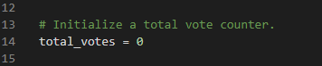
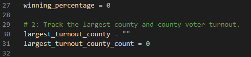
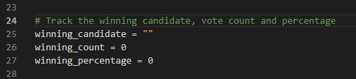
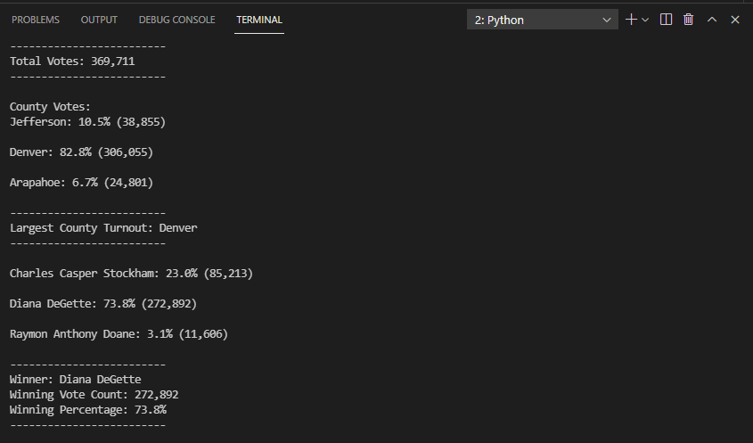

# Election_Analysis

## Election Audit Overview
The Colorado Board of Elections engaged us to complete an election audit of a recent local congressional election, specifically requesting that software be written and executed to complete the following tasks:
1.	Calculate the total number of votes cast.
2.	Generate a complete list of candidates who received votes.
3.	Calculate the total number of votes each candidate received.
4.	Calculate the percentage of votes each candidate won. 
5.	Determine the winner of the election based on popular vote.
#### Addendum
In an addendum, the following additional request was made:
	-  
	-  
 6.	Determine the county with the largest voter turnout.
#### Resources
The following resources were used to complete the requested work:
- Data Source: election_results.csv provided by client
- Software: Python 3.7.6, Visual Studio Code 1.56.0
## Election-Audit Results
	(Use a bulleted list.) (Insert images or examples of my code as support where necessary.)
- **A total of 369,711 votes were cast in the election.**
	- To determine this, a variable was initialized as show below:
	-  

	-  
	- Next, a for loop was constructed as follows (Note that the header row was stripped off before processing the remaining rows):
	-  

	-  
	- Then the results were output to the terminal and a text file:
	-  

	-   
- **The specifics for each county were as follows:**
	- Jefferson: 10.5% (38,855)
	- Denver: 82.8% (306,055)
	- Arapahoe: 6.7% (24,801)
	- Denver had the largest county turnout.
	- In order to obtain this,  a list and a dictionary were intialized
	-  

	-  
	-
	- Then, the county analysis was preformed and the output was sent both to the terminal and the text file.
	-   

	-  
	-  
- **The specifics for each candidate were as follows:**
	- Charles Casper Stockham: 23.0% (85,213)
	- Diana DeGette: 73.8% (272,892)
	- Raymon Anthony Doane: 3.1% (11,606)
	- The logic for the candidate calculations is as follows:
	- 

	-
- **Here are the details for the winning candidate:**
	- Winner: Diana DeGette
	- Winning Vote Count: 272,892
	- Winning Percentage: 73.8%
	- Here is an image of variable initialization for the winning candidate:
	-  

	-  
	- ...and here is an image of the winning candidate calculation:
	-  

	-  
- **Here is an image of the terminal output:**
-   

-  
- **Here is an image of the output file contents:**
-   

-  
## Election-Audit Summary (Further Work)
The requirements of the Colorado Board of Elections for this project were implemented in the simplest manner possible. These requirements could be expanded upon in various ways including the following:
1. **Candidate Performance by County**
	- Using the provided CSV file “as-is”, a new code implementation could break out the performance of each candidate in each county possibly in a “nested for loop.”
2. **Independent Formatting of Terminal and File Output**
	- Using the provided CSV file “as-is”, a new code implementation could format the output to the terminal and the output to the file independently possibly by implementing separate for loops for each and re-initializing shared variables between the loops.
3. **Party Affiliation**
	- It would be useful to see which political party each of the candidates is representing. While this could be achieved simplistically by including the candidate’s party affiliation in the same field with their name in the CSV file, a more sophisticated approach would be to create another field in the CSV file rows specifically for party affiliation. This in turn could be used in a new code implementation to calculate party performance at the county level, for instance.
4. **District Level Data**
	- A logical extension would be to collect and process data at the district level.  A new field would need to be added to the CSV file that indicates which district each county resides in. A new code implementation could then provide insight into candidate (and if implemented, party) performance at the district level. 

