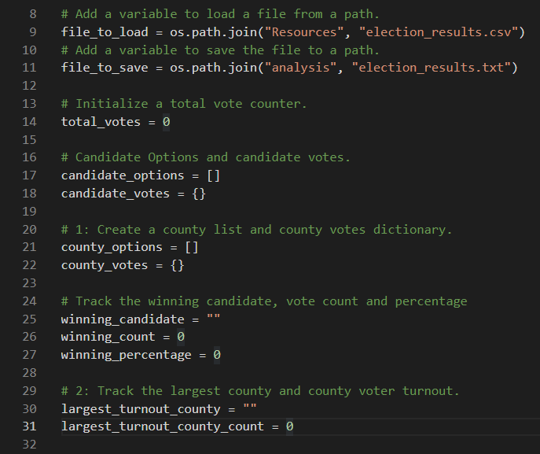
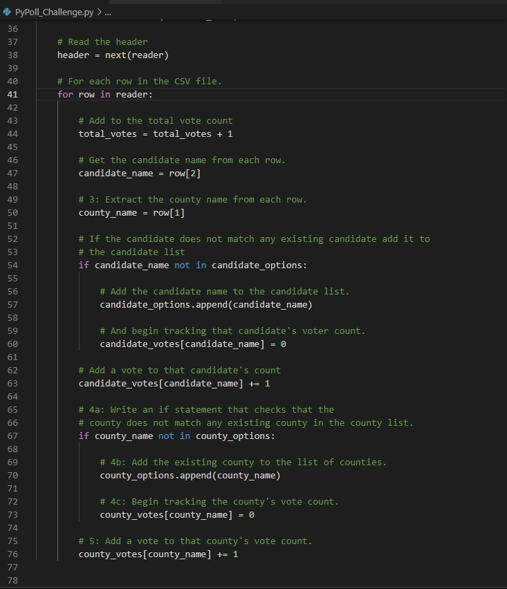
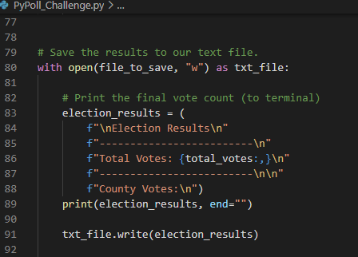
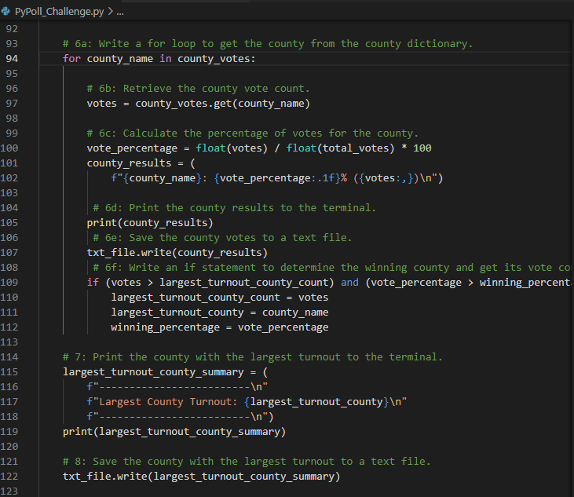
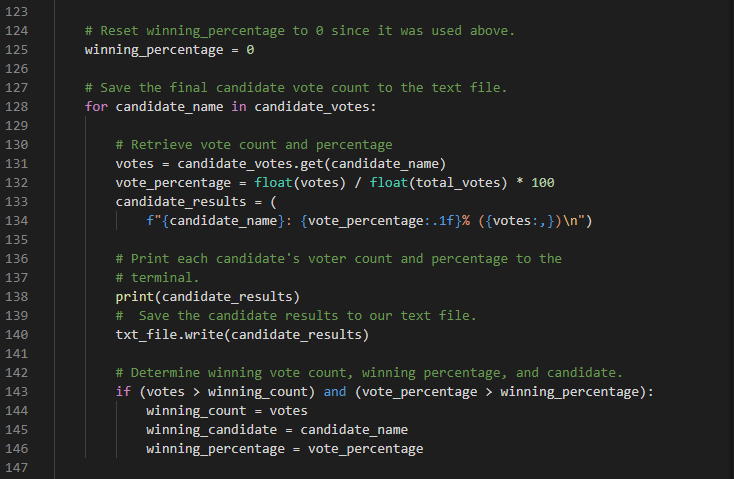
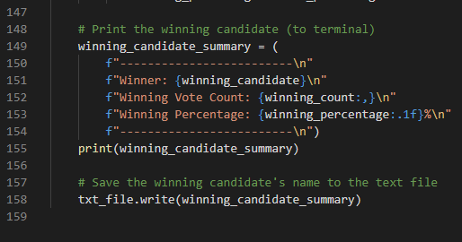
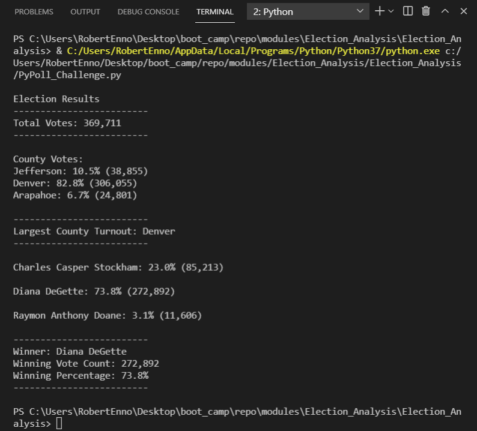
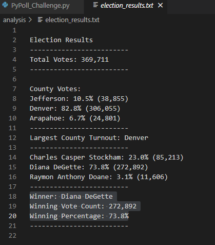

# Election_Analysis

## Election Audit Overview
The Colorado Board of Elections engaged us to complete an election audit of a recent local congressional election, specifically requesting that software be written and executed to complete the following tasks:
1. Calculate the total number of votes cast.
2. Generate a complete list of candidates who received votes.
3. Calculate the total number of votes each candidate received.
4. Calculate the percentage of votes each candidate won. 
5. Determine the winner of the election based on popular vote.
#### Addendum
In an addendum, the following additional request was made:  
1. Calculate the voter turnout in each county.
2. Calculate the percentage of total turnout for each county 
3. Determine the county with the largest voter turnout
#### Resources
The following resources were used to complete the requested work:
- Data Source: election_results.csv provided by client
- Software: Python 3.7.6, Visual Studio Code 1.56.0
## Election-Audit Results
#### Results Summary
- **A total of 369,711 votes were cast in the election.**
- **The percentage and total votes for each county were as follows:**
	- Jefferson: 10.5% (38,855)
	- Denver: 82.8% (306,055)
	- Arapahoe: 6.7% (24,801)
- **Denver had the largest county turnout.**
- **The percentage and total votes for each candidate were as follows:**
	- Charles Casper Stockham: 23.0% (85,213)
	- Diana DeGette: 73.8% (272,892)
	- Raymon Anthony Doane: 3.1% (11,606)
- **The details for the winning candidate were as follows:**
	- Winner: Diana DeGette
	- Winning Vote Count: 272,892
	- Winning Percentage: 73.8%
#### Code Implementations Details
- First, variables, lists, and dictionaries were initialized:
-  
- 
-
- Next, a for loop was constructed as follows to calculate both the candidate vote totals and the county vote totals (Note that the header row was stripped off before processing the remaining rows):
-  
- 
-  
- Then the total vote results were output to the terminal and a text file:
-  
- 
- 
- Next, the individual county specifics and the largest county turnout were calculated and output to the terminal and file:
- 
- 
- 
- After that, the performance of the indivudual candidates was calculated and recorded on the terminal and in the text file (Note that the "winning_percentage" variable had to be re-initialized to zero because it was previously used in the county calculations):
- 
- 
- 
- Finally, the details of the  winning candidate written both to the terminal and the output file:
-  
- 
-  
#### Terminal Output Image
-   
- 
- 
#### Text File Contents
-   
- 
-  
## Election-Audit Summary (Further Work)
The requirements of the Colorado Board of Elections for this project were implemented in the simplest manner possible. These requirements could be expanded upon in various ways including the following:
1. **Candidate Performance by County**
	- Using the provided CSV file “as-is”, a new code implementation could break out the performance of each candidate in each county possibly in a “nested for loop.”
2. **Independent Formatting of Terminal and File Output**
	- Using the provided CSV file “as-is”, a new code implementation could format the output to the terminal and the output to the file independently possibly by implementing separate for loops for each and re-initializing shared variables between the loops.
3. **Party Affiliation**
	- It would be useful to see which political party each of the candidates is representing. While this could be achieved simplistically by including the candidate’s party affiliation in the same field with their name in the CSV file, a more sophisticated approach would be to create another field in the CSV file rows specifically for party affiliation. This in turn could be used in a new code implementation to calculate party performance at the county level, for instance.
4. **District Level Data**
	- A logical extension would be to collect and process data at the district level.  A new field would need to be added to the CSV file that indicates which district each county resides in. A new code implementation could then provide insight into candidate (and if implemented, party) performance at the district level. 

